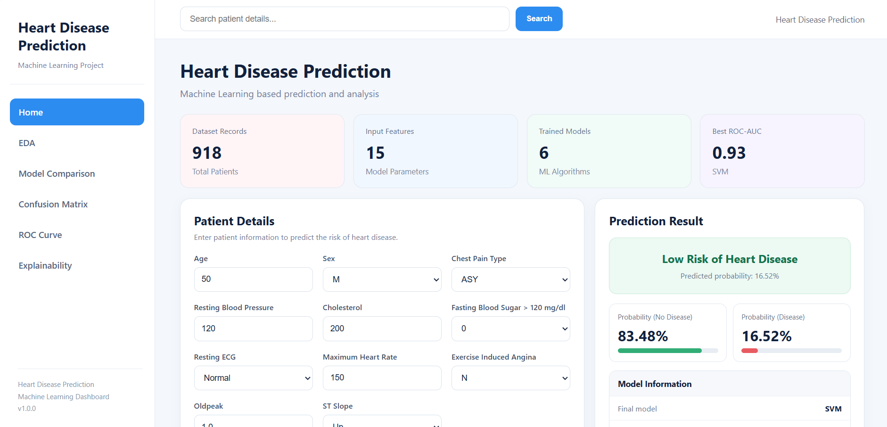

# Heart Disease Prediction

A machine learning-based web application that predicts the risk of heart disease from patient health parameters. The project includes data analysis, multiple machine learning models, model comparison, prediction, and explainability through an interactive Flask dashboard.

## Dashboard



## Project Overview

This project uses the Heart Disease dataset containing **918 patient records** and builds a complete machine learning workflow from data analysis to prediction.

The Flask dashboard allows users to enter patient information and get a heart disease risk prediction along with the predicted probability.

## Features

- Exploratory Data Analysis (EDA)
- Data preprocessing and feature encoding
- Training and comparison of **6 machine learning models**
- Model evaluation using:
  - Accuracy
  - Precision
  - Recall
  - F1-Score
  - ROC-AUC
- Confusion Matrix
- ROC Curve
- Patient-wise heart disease prediction
- Disease and no-disease probability in percentage
- Feature importance
- SHAP-based model explainability
- Interactive Flask web dashboard

## Machine Learning Models

The project compares the following models:

- Logistic Regression
- Decision Tree
- Random Forest
- Support Vector Machine (SVM)
- K-Nearest Neighbors (KNN)
- XGBoost

## Dataset

The dataset contains patient health and clinical features such as:

- Age
- Sex
- Chest Pain Type
- Resting Blood Pressure
- Cholesterol
- Fasting Blood Sugar
- Resting ECG
- Maximum Heart Rate
- Exercise Angina
- Oldpeak
- ST Slope

**Target variable:** `HeartDisease`

## Technologies Used

- Python
- Pandas
- NumPy
- Matplotlib
- Seaborn
- Scikit-learn
- XGBoost
- SHAP
- Flask
- HTML
- CSS

## Project Structure

```text
Heart-Data-Analysis/
│
├── app.py
├── requirements.txt
├── README.md
│
├── data/
│   └── heart.csv
│
├── models/
│   ├── heart_model.pkl
│   ├── heart_rf_model.pkl
│   ├── heart_shap_model.pkl
│   ├── heart_scaler.pkl
│   ├── heart_columns.pkl
│   ├── heart_numerical_cols.pkl
│   └── heart_model_comparison.csv
│
├── notebook/
│   └── Heart.ipynb
│
├── static/
│   └── style.css
│
└── templates/
    └── index.html
```

## How to Run

### 1. Clone the repository

```bash
git clone https://github.com/faizanfatmi/Heart-Data-Analysis.git
cd Heart-Data-Analysis
```

### 2. Install dependencies

```bash
pip install -r requirements.txt
```

### 3. Run the Flask application

```bash
python app.py
```

### 4. Open in browser

```text
http://127.0.0.1:5000
```

## Dashboard Sections

### Home
Provides patient input, heart disease prediction, probability percentages, and model information.

### EDA
Displays visual analysis of the dataset and important feature distributions.

### Model Comparison
Compares the performance of the trained machine learning models.

### Confusion Matrix
Shows the classification performance of the models using confusion matrices.

### ROC Curve
Visualizes ROC curves and ROC-AUC performance.

### Explainability
Uses feature importance and SHAP analysis to understand model predictions.

## Prediction Output

The dashboard displays:

- Predicted disease risk
- Probability of No Disease
- Probability of Disease

Probabilities are displayed as percentages, for example:

```text
Probability (No Disease): 83.48%
Probability (Disease): 16.52%
```

## Disclaimer

This project is developed for educational and machine learning purposes. It is not intended to replace professional medical diagnosis or medical advice.
